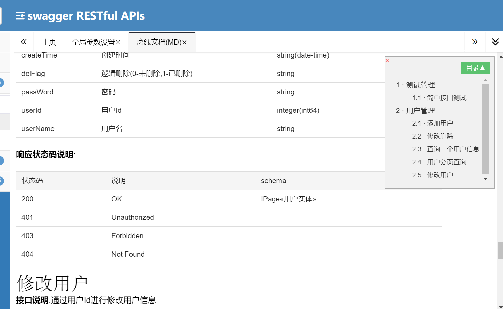
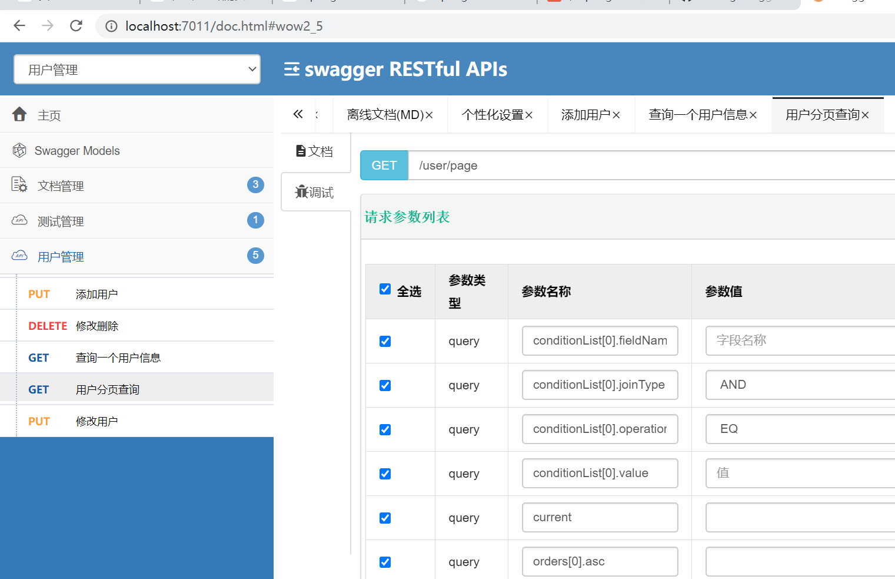

### 1、简要说明
* 本文章是搭建SpringBoot + Gradle + MyBatisPlus3.x + SwaggerBootstrapUi整合在线和离线APi
* 本框架以Java语言实现为主,基于[SpringBoot+Gradle+MyBatisPlus3.x+框架进行迭代](https://www.jianshu.com/p/d8f06bffdbd4)框架实现

### 2、核心功能
**在线文档**：[http://doc.xiaominfo.com/](http://doc.xiaominfo.com/)
该UI增强包主要包括两大核心功能：**文档说明** 和 **在线调试**
- **文档说明**：根据Swagger的规范说明，详细列出接口文档的说明，包括接口地址、类型、请求示例、请求参数、响应示例、响应参数、响应码等信息，使用swagger-bootstrap-ui能根据该文档说明，对该接口的使用情况一目了然。
- **在线调试**：提供在线接口联调的强大功能，自动解析当前接口参数,同时包含表单验证，调用参数可返回接口响应内容、headers、Curl请求命令实例、响应时间、响应状态码等信息，帮助开发者在线调试，而不必通过其他测试工具测试接口是否正确,简介、强大。

### 3、UI增强

>同时，swagger-bootstrap-ui在满足以上功能的同时，还提供了文档的增强功能，这些功能是官方swagger-ui所没有的，每一个增强的功能都是贴合实际,考虑到开发者的实际开发需要,是比不可少的功能，主要包括：
- **个性化配置**：通过个性化ui配置项，可自定义UI的相关显示信息
- **离线文档**：根据标准规范，生成的在线markdown离线文档，开发者可以进行拷贝生成markdown接口文档，通过其他第三方markdown转换工具转换成html或pdf，这样也可以放弃swagger2markdown组件
- **接口排序**：自1.8.5后，ui支持了接口排序功能，例如一个注册功能主要包含了多个步骤,可以根据swagger-bootstrap-ui提供的接口排序规则实现接口的排序，step化接口操作，方便其他开发者进行接口对接

## 4、UI特点

- 以markdown形式展示文档,将文档的请求地址、类型、请求参数、示例、响应参数分层次依次展示,接口文档一目了然,方便开发者对接
- 在线调试栏除了自动解析参数外,针对必填项着颜色区分,同时支持tab键快速输入上下切换.调试时可自定义Content-Type请求头类型
- 个性化配置项,支持接口地址、接口description属性、UI增强等个性化配置功能
- 接口排序,支持分组及接口的排序功能
- 支持markdown文档离线文档导出,也可在线查看离线文档
- 调试信息全局缓存,页面刷新后依然存在,方便开发者调试
- 以更人性化的treetable组件展示Swagger Models功能
- 响应内容可全屏查看,针对响应内容很多的情况下，全屏查看，方便调试、复制
- 文档以多tab方式可显示多个接口文档
- 请求参数栏请求类型、是否必填着颜色区分
- 主页中粗略统计接口不同类型数量
- 支持接口在线搜索功能
- 左右菜单和内容页可自由拖动宽度
- 支持自定义全局参数功能，主页包括header及query两种类型
- i18n国际化支持,目前支持：中文简体、中文繁体、英文
- JSR-303 annotations 注解的支持


### 5、 Maven与Gradle配置中引入Jar包

* 由于是`springfox-swagger`的增强UI包,所以基础功能依然依赖Swagger,`springfox-swagge`r的jar包必须引入
* maven 配置
```xml
<dependency>
 <groupId>io.springfox</groupId>
 <artifactId>springfox-swagger2</artifactId>
 <version>2.9.2</version>
</dependency>
```

* Gradle配置
```
 compile "io.springfox:springfox-swagger2:${swagger2_version}"
```

* 然后引入SwaggerBootstrapUi的jar包
* maven 配置
```xml
<dependency>
  <groupId>com.github.xiaoymin</groupId>
  <artifactId>swagger-bootstrap-ui</artifactId>
  <version>${lastVersion}</version>
</dependency>
```
* Gradle配置
```
compile "com.github.xiaoymin:swagger-bootstrap-ui:${swagger_bsi_version}"
```

### 6、代码实现
* EnableSwagger2 启动Swagger配置
* EnableSwaggerBootstrapUI　启动Swagger的UI配置
```java
@Configuration
@EnableSwagger2
@EnableSwaggerBootstrapUI
public class SwaggerConfiguration {

    private final String BASE_PACKAGE = "com.flong.springboot";

    @Bean
    public Docket createRestApi() {
        return new Docket(DocumentationType.SWAGGER_2)
                .apiInfo(apiInfo())
                //此组名可以通过数据库查出来加载里面，通过模块路径进行扫描不同微服务名的包路径。
                .groupName("用户管理")
                .select()
                .apis(RequestHandlerSelectors.basePackage(BASE_PACKAGE))
                .paths(PathSelectors.any())
                .build();
    }

    /**
     * api信息
     * @return
     */
    private ApiInfo apiInfo() {
        return new ApiInfoBuilder()
                .title("Swagger RESTful APIs")
                .description("Swagger RESTful APIs")
                .termsOfServiceUrl("http://github.com/jilongliang/")
                .contact("liangjl")
                .version("1.0")
                .build();
    }
}

```

* 实体类
```java
@ApiModel("用户实体")
public class User extends Model<User> implements Serializable {

    @TableId(type = IdType.ID_WORKER)
    @ApiModelProperty(value = "用户Id")
    private Long userId;

    /**
     * 用户名
     */
    @ApiModelProperty(value = "用户名")
    private String userName;
    /**
     * 密码
     */
    @ApiModelProperty(value = "密码")
    private String passWord;
    /**
     * 逻辑删除(0-未删除,1-已删除)
     */
    @TableLogic
    @ApiModelProperty(value = "逻辑删除(0-未删除,1-已删除)")
    private String delFlag;

    /**
     * 创建时间,允许为空,让数据库自动生成即可
     */
    @ApiModelProperty(value = "创建时间")
    private Date createTime;
}


```
* Controller类
```java
@Api(tags = "用户管理")
@RestController
@RequestMapping("/user")
public class UserController {

    @Autowired
    private UserMapper userMapper;

    @Autowired
    private UserService userService;

    /**
     * 添加
     */
    @PutMapping("/add")
    @ApiOperation(value = "添加用户",notes = "添加用户")
    public void add() {
        userMapper.insert(User.builder().userName("周伯通").passWord("123456").build());
    }

    /**
     * 修改
     * @param user
     */
    @PutMapping("/updateById")
    @ApiOperation(value = "修改用户",notes = "通过用户Id进行修改用户信息")
    public void updateById(@RequestBody User user) {
        userMapper.updateById(user);
    }
    /**
     * 删除通过多个主键Id进行删除
     * @param ids
     */
    @DeleteMapping("/deleteByIds")
    @ApiOperation(value = "修改删除",notes = "支持多个用户Id进行删除用户")
    public void deleteByIds(@RequestBody List<String> ids) {
        userMapper.deleteBatchIds(ids);
    }

    /**
     * 通过指定Id进行查询
     *
     * @param userId
     */
    @GetMapping("/getOne/{userId}")
    @ApiOperation(value = "查询一个用户信息",notes = "通过指定Id进行查询")
    public User getOne(@PathVariable("userId") Long userId) {
        User user = userMapper.selectById(userId);
        System.out.println(JSON.toJSON(user));
        return user ;
    }

    /**
     * 用户分页，参数有多个使用下标索引进行处理.如果有两个参数(如用户名和地址)：conditionList[0].fieldName=userName、 conditionList[0].fieldName=address
     * 未转码请求分页地址: http://localhost:7011/user/page?current=1&size=20&conditionList[0].fieldName=userName&conditionList[0].operation=LIKE&conditionList[0].value=周
     * 已转码请求分页地址: http://localhost:7011/user/page?current=1&size=20&conditionList[0].fieldName=userName&conditionList[0].operation=LIKE&conditionList[0].value=%E5%91%A8
     * @param page
     * @param conditions 条件
     * @return
     */
    @GetMapping("/page")
    @ApiOperation(value = "用户分页查询",notes = "通过多个条件进行查询用户信息")
    public IPage<User> page(Page page, Conditions conditions) {
        QueryWrapper<User> build = BuildConditionWrapper.build(conditions.getConditionList(), User.class);
        build.lambda().orderByDesc(User::getCreateTime);
        return userService.page(page, build);
    }


}
```

### 7、代码工程结构与运行结构
* 工程结构

* 离线文档

* 接口API

*　接口API


### 8、访问路径
* http://${host}:${port}/doc.html
```
http://localhost:7011/doc.html
```

### 9、工程源代码
* 工程代码在 swagger 分支 https://github.com/jilongliang/springboot/tree/swagger 同时把代码合并到分支.
